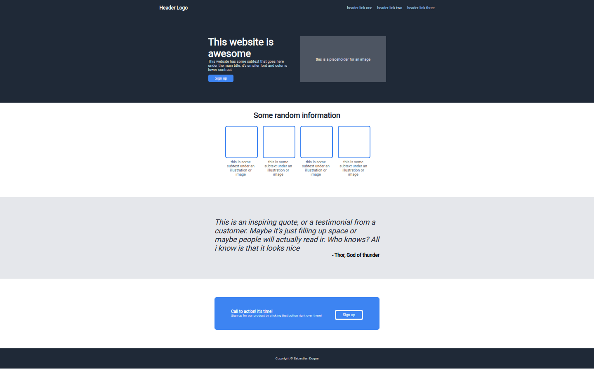

# Unit 02: Introduction to flexbox - Landing Page Development

The main goal of this project is to demonstrate knowledge in CSS flexbox and HTML structure, building a landing page. The exercise consists of designing the layout with four main sections and a footer, replicating a reference desing.

## Preview

  
*Example of the landing page layout.*

## Structure

The website includes common sections that are used on most homepage:

- **Header**
- **Hero section**
- **Information section**
- **Quote section**
- **Call to action**
- **Footer**

## Technologies Used

- **HTML5**
- **CSS3** (Flexbox)
- Visual Studio Code
- Git & GitHub

## Learning Goals

- Practice Flexbox layout techniques.